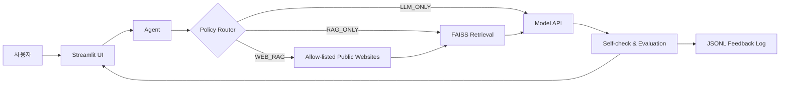

# Legal AI Assistant with QLoRA, RAG, and Agent Routing

> 한국 저작권·지식재산권 질문을 대상으로, 로컬 법률 문서 검색과 제한된 공공기관 웹 조회를 조합해 답변하는 Streamlit 기반 졸업작품 프로토타입입니다.

이 프로젝트는 단순한 챗봇 UI를 넘어 질문의 성격에 따라 `LLM_ONLY`, `RAG_ONLY`, `WEB_RAG` 경로를 선택하는 에이전트 구조를 구현합니다. 로컬 FAISS 인덱스에서 관련 법률 문서를 검색하고, 최신 정보가 필요한 경우 허용된 공공기관 도메인만 조회한 뒤 별도로 호스팅한 언어 모델에 컨텍스트를 전달합니다.

원래 데모에서는 QLoRA로 조정한 Qwen2.5-3B 계열 모델(`eunha123/qwen3b-legal-sft-test`)을 Google Colab에서 호스팅해 사용했습니다. 이 저장소에는 Streamlit 앱, 에이전트, RAG 및 정책 코드가 포함되어 있으며 모델 서버와 QLoRA 학습 코드는 포함되어 있지 않습니다.

> [!IMPORTANT]
> 이 프로젝트는 교육 및 연구 목적의 프로토타입입니다. 생성된 답변은 법률 자문이 아니며, 실제 의사결정에는 최신 법령과 전문가의 검토가 필요합니다.

## 주요 기능

- **질문별 경로 선택:** 규칙 기반 정책 또는 학습된 정책 체크포인트로 LLM, RAG, 웹 보강 RAG 중 하나를 선택합니다.
- **로컬 법률 문서 검색:** `all-MiniLM-L6-v2` 임베딩과 FAISS 내적 검색으로 관련 문서 조각을 찾습니다.
- **제한된 웹 조회:** 국가법령정보센터, 법원, 정부·공공기관 등 허용 목록에 있는 도메인만 요청하며 사설 IP 접근을 차단합니다.
- **응답 검토 및 로그:** 1차 답변을 모델로 다시 점검하고, 질문·선택 경로·평가 정보를 후속 학습용 JSONL 로그로 남깁니다.
- **Streamlit 인터페이스:** 홈, 챗봇 데모, 피드백 화면을 하나의 웹 앱으로 제공합니다.

## 시스템 구조



## 기술 스택

| 영역 | 사용 기술 |
|---|---|
| UI | Streamlit |
| Base model | Qwen2.5-3B 계열, QLoRA adapter |
| Embedding | Sentence Transformers `all-MiniLM-L6-v2` |
| Vector search | FAISS |
| Agent policy | 규칙 기반 라우팅, 선택적 PyTorch policy network |
| External context | Requests, BeautifulSoup, allow-list 기반 웹 수집 |
| Runtime | Python 3.10.11 |

## 빠른 시작

### 1. 환경 준비

```bash
python -m venv .venv
```

가상환경을 활성화한 뒤 의존성을 설치합니다.

```bash
pip install -r requirements.txt
```

### 2. 모델 서버 연결

앱은 `MODEL_URL` 환경 변수에서 텍스트 생성 서버 주소를 읽습니다. 값을 지정하지 않으면 `http://localhost:8000/generate`를 사용합니다.

```bash
# macOS / Linux
export MODEL_URL="https://your-model-server.example/generate"

# Windows PowerShell
$env:MODEL_URL="https://your-model-server.example/generate"
```

`.env.example`은 필요한 환경 변수의 형식을 보여주는 템플릿입니다. 현재 코드는 운영체제의 프로세스 환경 변수를 직접 읽습니다.

모델 서버는 다음 요청/응답 형식을 지원해야 합니다.

```json
{
  "prompt": "...",
  "max_new_tokens": 1024
}
```

```json
{
  "text": "생성된 답변"
}
```

### 3. 앱 실행

저장소에는 바로 불러올 수 있는 FAISS 인덱스가 포함되어 있습니다.

```bash
streamlit run app.py
```

원본 텍스트를 수정했다면 인덱스를 다시 생성할 수 있습니다.

```bash
python build_index.py
```

터미널에서 에이전트만 테스트하려면 다음 명령을 사용합니다.

```bash
python test_rag_agent.py
```

## 프로젝트 구조

```text
.
├── app.py                 # Streamlit UI
├── agent.py               # 라우팅, 자기 검토, 평가, 로그 처리
├── policy.py              # 규칙 기반 및 학습형 정책
├── rag_core.py            # 임베딩, FAISS 검색, 모델 API 호출
├── search_tools.py        # 허용 도메인 기반 웹 조회
├── build_index.py         # 법률 코퍼스에서 인덱스 생성
├── make_sft_dataset.py    # 실행 로그에서 SFT/DPO 형식 생성
├── train_policy.py        # 정책 네트워크 학습 실험 코드
├── data/law_corpus/       # 저작권 관련 텍스트 코퍼스
└── indexes/               # 데모용 FAISS 인덱스와 텍스트
```

`policy_ckpt.pt`가 있으면 학습형 정책을 사용하고, 없으면 규칙 기반 `SimplePolicy`로 자동 전환합니다. 실행 중 생성되는 로그는 `logs/rl_logs.jsonl`에 저장되며 Git에는 포함되지 않습니다.

## 데이터 출처

프로젝트 제작 과정에서 다음 공개 법률·공공데이터 자료를 참고했습니다.

- AI Hub
- 국가법령정보센터, 「저작권법」
- 문화체육관광부·공공누리의 저작권 및 공공저작물 안내 자료

저장소의 문서나 인덱스를 재사용할 때에는 각 원출처의 최신 이용 조건을 별도로 확인해야 합니다.

## 현재 범위와 한계

- 모델 추론 서버는 별도로 실행해야 하며 이 저장소에 포함되어 있지 않습니다.
- 웹 보강은 범용 검색 엔진이 아니라 코드에 정의된 공식 사이트 목록을 순회하는 방식입니다.
- 포함된 코퍼스는 저작권 중심이므로 다른 법률 분야의 질문에는 충분한 근거를 제공하지 못할 수 있습니다.
- 법률 정확도·응답 속도에 대한 검증된 정량 벤치마크는 아직 제공하지 않습니다.

## Contributors

- eunha348
- injai-lab (InJae_AI)
